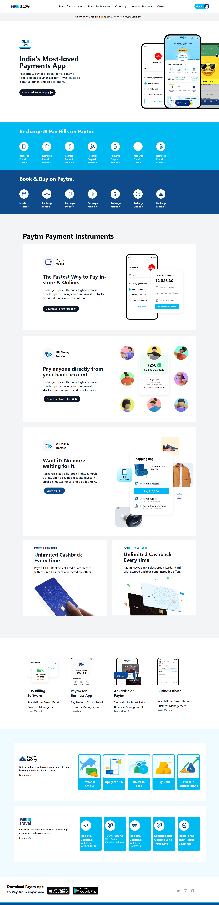

# Paytm Home Page Clone

## Technology used
 

## Average time to complete

### Checkout the live website [here](https://mayankraj-paytm.netlify.app/).

## My Learnings

- This was my first project in Tailwind CSS, so learned about how to use Tailwind in product with CDN.
- Learned different classes in Tailwind.
- Learned how Tailwind is mobile first.
- Learned hover effects to expand images.

---

